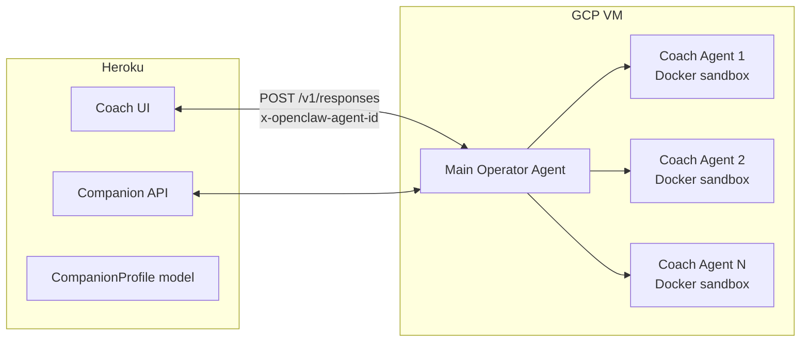
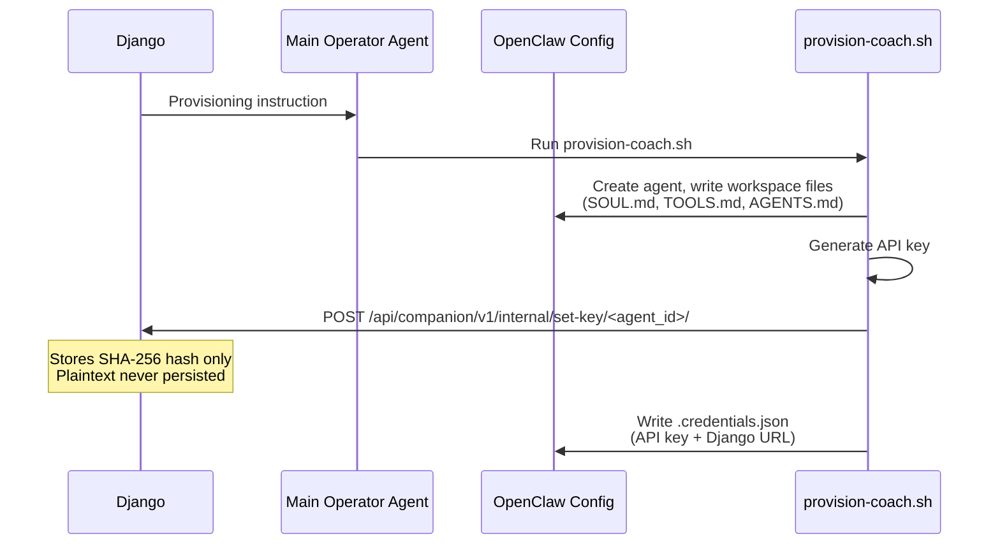

# :material-server-outline: Companion Operator Guide

How the companion is architected, provisioned, and operated.

---

## Architecture

Each coach gets their own AI agent running inside OpenClaw — an open-source agent infrastructure platform. These agents run on a dedicated GCP VM (the "companion operator") rather than on Heroku with the Django app.



!!! note "Why separate infrastructure"
    - Agent memory, sandboxing, and tool execution need **persistent processes** — not stateless Heroku dynos
    - **Docker sandbox isolation** per coach: each agent runs in its own container with zero access to other coaches' data
    - OpenClaw handles conversation history, compaction, tool routing, and LLM calls natively

---

## Provisioning Flow

When a coach is provisioned from the Django admin:



!!! success "Security: operator-generated keys"
    Django used to generate keys and store them. After a Copilot review flagged this, the architecture was inverted — **the operator generates the key and registers the hash with Django**. This way the plaintext never exists in Django's database.

---

## Key Design Decisions

=== ":material-cube-outline: OpenClaw as infrastructure"

    **Decision:** Use OpenClaw instead of building a custom agent stack.

    We evaluated building a custom companion agent stack (personality model, memory system, scheduling engine). Using OpenClaw instead:

    - `SOUL.md` = personality
    - `MEMORY.md` = memory
    - cron = scheduling

    **Outcome:** Eliminated months of custom infrastructure work.

=== ":material-account-multiple-outline: One agent per coach"

    **Decision:** Each coach gets their own isolated OpenClaw agent.

    This means:

    - Separate conversation history
    - Separate memory
    - Separate workspace

    Coaches **never share context**.

=== ":material-docker: Sandbox isolation"

    Each coach agent runs in a Docker container (`companion-sandbox:latest`) with:

    | Setting | Value |
    |---------|-------|
    | Networking | Bridge (internet access, no host network) |
    | Workspace | `workspaceAccess: rw` for own workspace only |
    | Exec | `journeyloop` CLI only |
    | Denied tools | `browser`, `gateway`, `web_search`, `image` |

=== ":material-code-braces: Generated CLI"

    **Decision:** Generate the `journeyloop` CLI from the Django OpenAPI spec via `openapi-python-client`.

    **Why:** When the API changes, rebuild the sandbox image. This keeps the CLI and API in sync without manual maintenance — no hand-written client code to drift.

---

## Operations

!!! warning "GCP VM"
    **IP:** `34.63.156.77` — SSH as `mlamina`

**Key services on the VM:**

| Service | Description |
|---------|-------------|
| `openclaw-gateway.service` | OpenClaw gateway — runs natively (not Docker), port 18789 |
| `cloudflared.service` | Cloudflare tunnel (ephemeral URL, changes on restart) |

!!! danger "Tunnel URL drift"
    Django staging (`https://staging.journeyloop.ai`) has `OPENCLAW_GATEWAY_URL` pointing to the current tunnel URL. **Update this whenever the tunnel restarts.**

**Rebuild the sandbox image after an API change:**

```bash title="Rebuild sandbox"
ssh mlamina@34.63.156.77
cd ~/journeyloop/operator
./scripts/build-sandbox.sh
```

Then restart the OpenClaw gateway so it picks up the new image:

```bash title="Restart gateway"
sudo systemctl restart openclaw-gateway
```

---

**Companion operator files:** [`arc-eng/journeyloop/operator/`](https://github.com/arc-eng/journeyloop/tree/main/operator) — provisioning scripts, Dockerfile, templates (migrated from the now-archived [`arc-eng/companion-operator`](https://github.com/arc-eng/companion-operator))
