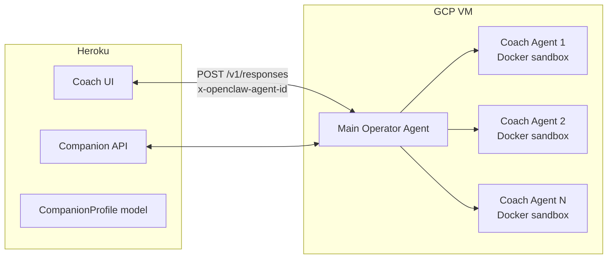
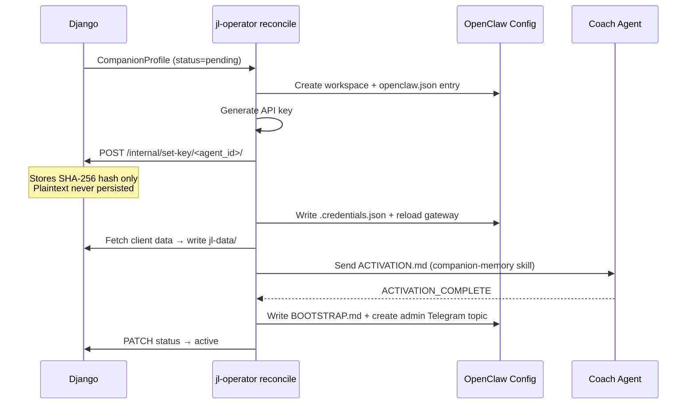

# :material-server-outline: Companion Operator Guide

How the companion is architected, provisioned, and operated.

---

## Architecture

Each coach gets their own AI agent running inside OpenClaw — an open-source agent infrastructure platform. These agents run on a dedicated GCP VM (the "companion operator") rather than on Heroku with the Django app.


```mermaid
graph LR
    subgraph Heroku
        UI[Coach UI]
        API[Companion API]
        CPM[CompanionProfile model]
    end
    subgraph GCP VM
        OC[Main Operator Agent]
        A1[Coach Agent 1<br/>Docker sandbox]
        A2[Coach Agent 2<br/>Docker sandbox]
        A3[Coach Agent N<br/>Docker sandbox]
        OC --> A1
        OC --> A2
        OC --> A3
    end
    UI <-->|POST /v1/responses<br/>x-openclaw-agent-id| OC
    API <--> OC
```

!!! note "Why separate infrastructure"
    - Agent memory, sandboxing, and tool execution need **persistent processes** — not stateless Heroku dynos
    - **Docker sandbox isolation** per coach: each agent runs in its own container with zero access to other coaches' data
    - OpenClaw handles conversation history, compaction, tool routing, and LLM calls natively

---

## Provisioning Flow

Provisioning is fully automated via `jl-operator reconcile`. The reconciler polls Django for `CompanionProfile` records in `pending` status and drives them through a state machine:

```
pending → provisioning → activating → active
                                    ↘ error (retried automatically)
```


```mermaid
sequenceDiagram
    participant Django
    participant Reconciler as jl-operator reconcile
    participant OpenClaw as OpenClaw Config
    participant Agent as Coach Agent

    Django->>Reconciler: CompanionProfile (status=pending)
    Reconciler->>OpenClaw: Create workspace + openclaw.json entry
    Reconciler->>Reconciler: Generate API key
    Reconciler->>Django: POST /internal/set-key/<agent_id>/
    Note over Django: Stores SHA-256 hash only<br/>Plaintext never persisted
    Reconciler->>OpenClaw: Write .credentials.json + reload gateway
    Reconciler->>Django: Fetch client data → write jl-data/
    Reconciler->>Agent: Send ACTIVATION.md (companion-memory skill)
    Agent-->>Reconciler: ACTIVATION_COMPLETE
    Reconciler->>OpenClaw: Write BOOTSTRAP.md + create admin Telegram topic
    Reconciler->>Django: PATCH status → active
```

!!! success "Security: operator-generated keys"
    Django used to generate keys and store them. After a Copilot review flagged this, the architecture was inverted — **the operator generates the key and registers the hash with Django**. This way the plaintext never exists in Django's database.

**Error recovery:** stale `activating` or `error` profiles are retried automatically on the next reconcile run. The reconciler is idempotent — safe to re-run at any point.

For the complete state machine reference, see [`operator/docs/reconciler.md`](https://github.com/arc-eng/journeyloop/blob/main/operator/docs/reconciler.md) in the source repo.

---

## Key Design Decisions

=== ":material-cube-outline: OpenClaw as infrastructure"

    **Decision:** Use OpenClaw instead of building a custom agent stack.

    We evaluated building a custom companion agent stack (personality model, memory system, scheduling engine). Using OpenClaw instead:

    - `SOUL.md` = personality
    - `MEMORY.md` = memory
    - cron = scheduling

    **Outcome:** Eliminated months of custom infrastructure work.

=== ":material-account-multiple-outline: One agent per coach"

    **Decision:** Each coach gets their own isolated OpenClaw agent.

    This means:

    - Separate conversation history
    - Separate memory
    - Separate workspace

    Coaches **never share context**.

=== ":material-docker: Sandbox isolation"

    Each coach agent runs in a Docker container (`companion-sandbox:latest`) with:

    | Setting | Value |
    |---------|-------|
    | Networking | Bridge (internet access, no host network) |
    | Workspace | `workspaceAccess: rw` for own workspace only |
    | Exec | `journeyloop` CLI only |
    | Denied tools | `browser`, `gateway`, `web_search`, `image` |

=== ":material-code-braces: Generated CLI"

    **Decision:** Generate the `journeyloop` CLI from the Django OpenAPI spec via `openapi-python-client`.

    **Why:** When the API changes, rebuild the sandbox image. This keeps the CLI and API in sync without manual maintenance — no hand-written client code to drift.

---

## Companion CLI: Analyze Commands

The `journeyloop` CLI inside each companion's sandbox includes an `analyze` subgroup for deeper client and session analysis:

| Command | Purpose |
|---------|---------|
| `journeyloop analyze progress` | Analyze a client's progress toward their goals |
| `journeyloop analyze patterns` | Analyze coaching patterns across sessions |
| `journeyloop analyze arc` | Analyze the arc of a specific session |

These complement the existing data-access commands (`clients`, `sessions`, `goals`, etc.). Where the data commands retrieve records, the analyze commands return AI-generated interpretation — the companion delegates this work to the Django backend rather than doing all analysis in-context.

The companion's `TOOLS.md` documents which commands are available and when to use them.

---

## Operations

!!! warning "GCP VM"
    **IP:** `34.63.156.77` — SSH as `mlamina`

**Key services on the VM:**

| Service | Description |
|---------|-------------|
| `openclaw-gateway.service` | OpenClaw gateway — runs natively (not Docker), port 18789 |
| `cloudflared.service` | Cloudflare tunnel (ephemeral URL, changes on restart) |

!!! danger "Tunnel URL drift"
    Django staging (`https://staging.journeyloop.ai`) has `OPENCLAW_GATEWAY_URL` pointing to the current tunnel URL. **Update this whenever the tunnel restarts.**

**Rebuild the sandbox image after an API change:**

```bash title="Rebuild sandbox"
ssh mlamina@34.63.156.77
cd ~/journeyloop/operator
./scripts/build-sandbox.sh
```

Then restart the OpenClaw gateway so it picks up the new image:

```bash title="Restart gateway"
sudo systemctl restart openclaw-gateway
```

---

## Agent → Operator Communication (Dotfile IPC)

Sandboxed agents cannot send messages directly. They communicate with the operator by writing JSON request files to their workspace. The operator monitor detects these files and acts on them.

Two request types are supported:

| Type | Purpose | Companion command |
|------|---------|-----------------|
| `deliver-file` | Send a PDF or file to the coach | `journeyloop companion deliver-file <file>` |
| `telegram-ui` | Send a poll or message with inline buttons | `journeyloop companion send-poll` / `send-message` |

Since March 2026, agents no longer need to specify their Telegram ID — the monitor auto-resolves it from `.credentials.json`.

[:octicons-arrow-right-24: Dotfile IPC Reference](dotfile-ipc.md)

---

## Monitoring

The companion operator ships a Prometheus + Grafana stack covering message throughput, token cost, session health, and VM/container resources.

Access Grafana via SSH tunnel to `127.0.0.1:3000` on the GCP VM — no auth required.

[:octicons-arrow-right-24: Monitoring Stack](monitoring.md)

---

**Companion operator files:** [`arc-eng/journeyloop/operator/`](https://github.com/arc-eng/journeyloop/tree/main/operator) — provisioning scripts, Dockerfile, templates (migrated from the now-archived [`arc-eng/companion-operator`](https://github.com/arc-eng/companion-operator))
