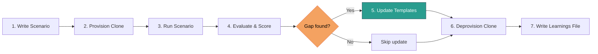

# Companion Training Program

The companion training program is how we make JourneyLoop's coach companion agents better over time. It doesn't retrain a model — it refines the **template files** that define how companions think and behave. Better instructions produce better companions.

!!! info "Where it lives"
    The training loop lives in `~/openclaw-operator/trainer/` on the companion operator VM. It is run **manually, on demand** — not on a schedule.

---

## What's Actually Being Trained

Each companion agent runs from a set of files that define its identity, procedures, and environment. Training improves the *base versions* of these files so that every newly provisioned coach gets the best version that exists at that moment.

| File | What it defines |
|---|---|
| `SOUL.md` | Personality, values, instincts — who the companion is |
| `AGENTS.md` | Procedures and workflows — what it does and how |
| `TOOLS.md` | Paths, syntax, workspace layout — what it has access to |
| `skills/` | On-demand task guides: `prep-session`, `post-session`, `coaching-feedback` |

The canonical base versions live in `trainer/best-templates/` and `trainer/skills/`. These are the source of truth for new provisions.

!!! note "Existing agents are not updated"
    Agents already provisioned to coaches have diverged intentionally — they've been personalized through bootstrap and real use. Only new provisions get the updated base. See [Production Promotion](#production-promotion).

---

## The Training Loop



### 1. Scenario Generation

A scenario file defines the full test context:

- **Coach persona** — name, niche, tech comfort level, emotional state
- **Scripted opening message** — the first thing the persona sends
- **Follow-up messages** — ordered, to be sent naturally during the run
- **Evaluation checklist** — specific behaviors to watch for

### 2. Clone Provisioning

A temporary agent is spun up — `trainer-clone-<timestamp>` — loaded with:

- The current `trainer/best-templates/` files
- Real test credentials for JourneyLoop staging

The clone is isolated and disposable. It has no memory of prior runs.

### 3. Running the Scenario

The Companion Operator roleplays as the coach persona, sending messages to the clone one at a time via the API, following the script naturally. The goal is a realistic interaction — not a mechanical checkbox exercise.

### 4. Evaluation

Responses are scored on four rubric dimensions, each rated **1–5**:

| Dimension | What it measures |
|---|---|
| **Warm** | Did it match the coach's emotional register? Acknowledge difficulty before pivoting? |
| **Efficient** | No padding, no repetition, appropriate depth for the context? |
| **Error-free** | Accurate data, correct quotes, no hallucinated details? |
| **Accessible** | No jargon, no leaking of internal technical steps to the coach? |

### 5. Documentation

A learnings file is written at `trainer/learnings/YYYY-MM-DD-<scenario>.md` containing:

- Full transcript
- Scores with explanatory notes
- Key moments flagged as ✅ or ❌
- Specific proposed changes to templates or skills

### 6. Template Updates

If the run revealed a real gap, `trainer/best-templates/` and/or `trainer/skills/` files are edited directly. If the score was high or no actionable gap was found, nothing changes.

!!! tip "Change only what broke"
    Each update targets a specific failure mode. Broad rewrites in response to a single scenario are a signal that the scenario wasn't narrow enough.

### 7. Clone Deprovisioning

The clone is torn down. No state is retained.

---

## Evaluation Rubric in Detail

=== "Warm (1–5)"

    Measures emotional attunement — whether the companion meets the coach where they are before offering help or information.

    - **5** — Acknowledges difficulty or frustration directly, then transitions smoothly
    - **3** — Notices tone but pivots too quickly or uses generic language
    - **1** — Jumps straight to task with no acknowledgment

=== "Efficient (1–5)"

    Measures response economy — no padding, no restating what the coach just said, no unnecessary hedging.

    - **5** — Every sentence earns its place; appropriate length for the request
    - **3** — Some repetition or throat-clearing before the actual answer
    - **1** — Long preamble, repeated points, filler phrases

=== "Error-free (1–5)"

    Measures factual accuracy — especially around data fetched from JourneyLoop (client names, session dates, transcript quotes).

    - **5** — All data accurate; nothing fabricated
    - **3** — Minor inconsistency or vague reference where specificity was available
    - **1** — Hallucinated detail or incorrect data presented confidently

=== "Accessible (1–5)"

    Measures whether internal technical mechanics stay invisible to the coach.

    - **5** — Output reads as natural colleague behaviour; no mention of tools, files, or internal steps
    - **3** — Slight awkwardness suggesting internal scaffolding (e.g. "let me check my notes")
    - **1** — Internal process leaks explicitly into the response

---

## Scenarios Completed

| Scenario | What it tested |
|---|---|
| `new-coach-onboarding` | First contact — does the companion feel like a colleague, not a manual? |
| `bootstrap-with-data` | Data lookup accuracy during onboarding |
| `frustrated-coach` | Emotional attunement — acknowledging the feeling before helping |
| `session-prep-real-data` | Prep from real client data with a question drawn from the brief |
| `transcript-deep-dive` | Transcript download, meta creation, and analysis quality |
| `post-session-debrief` | Capturing what happened after a call |
| `coaching-feedback-shift` | SHIFT framework feedback with blind spots and pattern recognition |
| `coaching-feedback-ask-first` | Does it ask what the *coach* noticed before sharing observations? |
| `coaching-feedback-restorative` | Acknowledging a difficult session emotionally before pivoting |
| `coaching-feedback-icf-credential` | Calibrating feedback to ICF markers for credential-track coaches |

---

## What the Companion Learns About a Coach

Bootstrap (first contact) is the one-time calibration conversation. The companion gathers context naturally — one question at a time, never a form:

- Coaching practice shape (niche, client types, volume)
- Current clients and active engagements
- What the coach most wants from the companion relationship
- Preferred communication style and feedback cadence
- Preferred feedback framework (SHIFT, ICF, iPEC, or their own model)

At the end of bootstrap:

1. **`MEMORY.md`** is written with everything learned
2. **`SOUL.md`** is rewritten — the one-time bootstrap section is removed, replaced with coach-specific context
3. From this point on, the companion never asks about things it can look up

### Per-Client Relationship Files

Over time, the companion builds `relationships/<client-slug>.md` for each client the coach works with. These files capture:

- How the coach relates to this client
- What kind of feedback the coach wants about them
- Client background and context
- Observed patterns across sessions
- A log of every feedback conversation involving this client

Relationship files are read automatically before any session prep, debrief, or feedback work involving that client.

---

## Production Promotion

Changes never go live automatically.

```
trainer/best-templates/
        │
        │  (human reviews learnings file, approves specific change)
        ▼
workspace/coach-template/
        │
        │  (next new-coach provision)
        ▼
live companion agent
```

!!! danger "No automatic promotion"
    The Companion Operator documents what changed and why in the learnings file. A human (Marco) approves before anything moves to `workspace/coach-template/`. Existing coaches are never silently updated.

When a scenario reveals a fix worth shipping, the workflow is:

1. Learnings file reviewed and approved
2. Change applied to `workspace/coach-template/`
3. Next provisioned coach inherits it
4. Existing agents remain on their personalized version

---

*Last updated: 2026-02-23*
