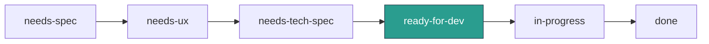

# Agent Roster & Org Structure

JourneyLoop is built and operated by a team of AI agents running on OpenClaw. Each agent has a defined role, a set of responsibilities, and a communication protocol. **Marco Lamina** (founder) is the human stakeholder who approves work, makes product decisions, and owns escalation.

---

## Agent Overview

<div class="grid cards" markdown>

- :material-brain: **CTO**

    Owns technical architecture. Writes tech specs, authors ADRs, reviews PRs.

    `agent:cto:main`

- :material-clipboard-list: **PM**

    Owns the product backlog. Writes specs, manages issue lifecycle, prioritizes.

    `agent:pm:main`

- :material-pencil-ruler: **UX Engineer**

    Owns design principles and wireframes. Reviews PRs for UX quality.

    `agent:ux:main`

- :material-code-braces: **SWE**

    Implements features, fixes bugs, writes tests. Works from `ready-for-dev`.

    `agent:swe:main`

- :material-file-document: **Docs Agent**

    Owns the documentation site. Accepts structured `WRITE` / `READ` / `LIST` messages.

    `agent:docs:main`

- :material-account-tie: **Ray**

    Practitioner advisor and product tester. A practicing executive coach using JourneyLoop on staging.

    `agent:ray:main`

- :material-shield-search: **Audit Agent**

    Monitors all agent activity. Runs every 20 minutes; maintains structured audit logs.

    `agent:audit:main`

- :material-stethoscope: **Doctor**

    Infrastructure diagnostic tool. Audits multi-agent setup for misconfigurations and policy violations.

    `agent:doctor:main`

</div>

---

## Agent Profiles

=== ":material-brain: CTO"

    **Session key:** `agent:cto:main`  
    **Slack:** `#development`

    Owns technical architecture for JourneyLoop. Translates product specs into engineering plans and ensures the codebase stays healthy.

    **Responsibilities**

    - Write tech specs (`planning/<feature>/tech-spec.md`) for issues labeled `needs-tech-spec`
    - Author Architecture Decision Records (ADRs) as GitHub issues labeled `adr`
    - Review PRs for architectural consistency, security, and code quality
    - Identify and quantify technical debt
    - Maintain architectural consistency across `arc-eng/journeyloop` and `arc-eng/journeyloop-startup-assistant`

    !!! warning "Key Constraint"
        Never auto-proceeds. Always checks in with Marco via `#development` before starting a tech spec. Iterates in conversation with Marco rather than writing complete specs upfront.

    !!! info ""
        Signs GitHub comments: `— CTO Agent`

=== ":material-clipboard-list: PM"

    **Session key:** `agent:pm:main`  
    **Slack:** `#development`

    Owns the product backlog for JourneyLoop. Writes specs, manages issue lifecycle, and keeps the team aligned on priorities.

    **Responsibilities**

    - Write user stories, feature specs, and briefs
    - Manage GitHub issue labels through the lifecycle
    - Prioritize the backlog in consultation with Marco
    - Escalate when product decisions require founder input

    !!! note "Out of Scope"
        Does not make architecture decisions, manage sprints, or touch code.

=== ":material-pencil-ruler: UX Engineer"

    **Session key:** `agent:ux:main`  
    **Slack:** `#development`

    Owns design principles, wireframes, and user experience for JourneyLoop.

    **Responsibilities**

    - Design UI layouts and wireframes (HTML/CSS prototypes)
    - Define and maintain design principles and component patterns
    - Review PRs for UX quality
    - Champion the user's perspective in technical discussions
    - Write `ux.md` files in feature planning folders

    !!! tip "Trigger"
        Activated by issues labeled `needs-ux`, dispatched by PM.

=== ":material-code-braces: SWE"

    **Session key:** `agent:swe:main`  
    **Slack:** `#development`

    Implements features, fixes bugs, writes tests, and maintains code quality across `arc-eng/journeyloop`.

    **Responsibilities**

    - Implement features from tech specs when issues reach `ready-for-dev`
    - Follow gitflow: feature branch (named with issue number) → commits → PR
    - Write and maintain tests
    - Maintain `CLAUDE.md` files across repos
    - Fix bugs and handle tech debt items

    !!! warning "Not Auto-Triggered"
        `ready-for-dev` is the final pipeline stage — Marco initiates dev work manually.

=== ":material-file-document: Docs Agent"

    **Session key:** `agent:docs:main`  
    **Repo:** `arc-eng/journeyloop-docs`

    Owns the JourneyLoop documentation site (MkDocs Material, live at http://192.168.1.30:8001).

    **Responsibilities**

    - Write and update markdown documentation files on instruction
    - Maintain `mkdocs.yml` navigation
    - Rebuild and restart the MkDocs service after every write
    - Answer retrieval queries with doc content

    Not conversational. Accepts structured messages:

    | Message | Purpose |
    |---|---|
    | `WRITE: <path> \| <title> \| <content>` | Write or update a doc |
    | `READ: <query>` | Retrieve relevant docs |
    | `LIST` | List all current docs |

=== ":material-account-tie: Ray"

    **Session key:** `agent:ray:main`

    A practicing executive coach who uses JourneyLoop on staging. Ray serves as both a real user and a coaching practitioner advisor.

    === "As Product Tester"
        Logs into `staging.journeyloop.ai` and uses the product as a real coach — not running test scripts, but doing actual coaching work and surfacing friction.

        **Active staging clients:** David Chen · Neha Sharma · Samantha Lin

    === "As Practitioner Advisor"
        Provides gut-checks on coach workflow design, UX assumptions, and feature trade-offs from a practitioner's perspective.

    !!! tip "How to Reach Ray"
        Dispatch tasks via `sessions_send`. Ray responds conversationally — give context, ask something specific.

=== ":material-shield-search: Audit"

    **Session key:** `agent:audit:main`

    Monitors all agent activity across the OpenClaw system and maintains a structured audit trail.

    | Property | Value |
    |---|---|
    | Run frequency | Every 20 minutes (cron) |
    | Output | `logs/YYYY-MM-DD-<slug>.md` in audit workspace |
    | Flags | Errors, unexpected behavior, security issues |

=== ":material-stethoscope: Doctor"

    **Session key:** `agent:doctor:main`

    Infrastructure diagnostic tool. Audits the multi-agent setup for misconfigurations, isolation failures, and policy violations.

    !!! info "Output Style"
        Clinical, precise — no filler. Reports findings as **Critical** / **Warning** / **Passing** with suggested fixes.

---

## Supporting Agents

These agents run on the same OpenClaw instance but serve Dobby's personal or other-client contexts.

| Agent | Session | Purpose |
|---|---|---|
| `coding-agent` | `agent:coding-agent:main` | General-purpose coding assistant for Dobby |
| `screen-dev` | `agent:screen-dev:main` | Frontend for Dobby's 5" touchscreen UI (Flask + Alpine.js + Tailwind, Pi 5) |
| `secops` | `agent:secops:main` | Security auditing for OpenClaw deployments and host hardening |
| `business-analyst` | `agent:business-analyst:main` | Daily strategic business research for JourneyLoop |
| `caitlin-assistant` | `agent:caitlin-assistant:main` | Business assistant for Caitlin Ryan (ocean-themed wellness pivot) |
| `voice` | `agent:voice:main` | Reformats text for voice/TTS output |
| `coach-test` | `agent:coach-test:main` | Staging coaching companion — Sarah Chen persona |

---

## Collaboration Protocols

### Issue Lifecycle

Issues in `arc-eng/journeyloop` move through these labels, each triggering the responsible agent:



!!! note "Marco's Gate"
    Marco reviews the tech spec in `#development` and transitions the issue to `ready-for-dev` when approved.

### Agent-to-Agent Communication

Agents dispatch work to each other via:

```python
sessions_send(sessionKey="agent:<name>:main", message="...")
```

!!! danger "Never Use Slack @mentions"
    Bots don't receive Slack @mentions reliably. Always use `sessions_send` for agent-to-agent dispatch.

### Slack Channels

| Channel | Purpose |
|---|---|
| `#development` | Work log, spec reviews, and all review coordination |
| `#bot-problems` | Blockers and errors that need human attention |

### Marco's Role

Marco Lamina is the founder and primary stakeholder.

- Approves work before agents start (no autonomous sprinting)
- Makes product prioritization calls
- Reviews tech specs and UX before dev proceeds
- Has final say on architecture trade-offs, vendor decisions, and scope

!!! warning "Escalation Triggers"
    Agents escalate to Marco when:

    - Architecture decisions carry significant trade-offs
    - Technical blockers require business context
    - Effort estimate exceeds expectations by >2×

---

## Repos

| Repo | Purpose |
|---|---|
| [`arc-eng/journeyloop`](https://github.com/arc-eng/journeyloop) | Main Django codebase — user stories, feature specs, bugs, tech specs, ADRs |
| [`arc-eng/journeyloop-startup-assistant`](https://github.com/arc-eng/journeyloop-startup-assistant) | Planning — roadmap, business intel, revenue analysis, strategic decisions |
| [`arc-eng/journeyloop-docs`](https://github.com/arc-eng/journeyloop-docs) | Documentation site (this site) |
| [`arc-eng/journeyloop/operator/`](https://github.com/arc-eng/journeyloop/tree/main/operator) | OpenClaw companion infrastructure scripts (monorepo — migrated from archived [`arc-eng/companion-operator`](https://github.com/arc-eng/companion-operator)) |

---

*Last updated: 2026-02-23*
