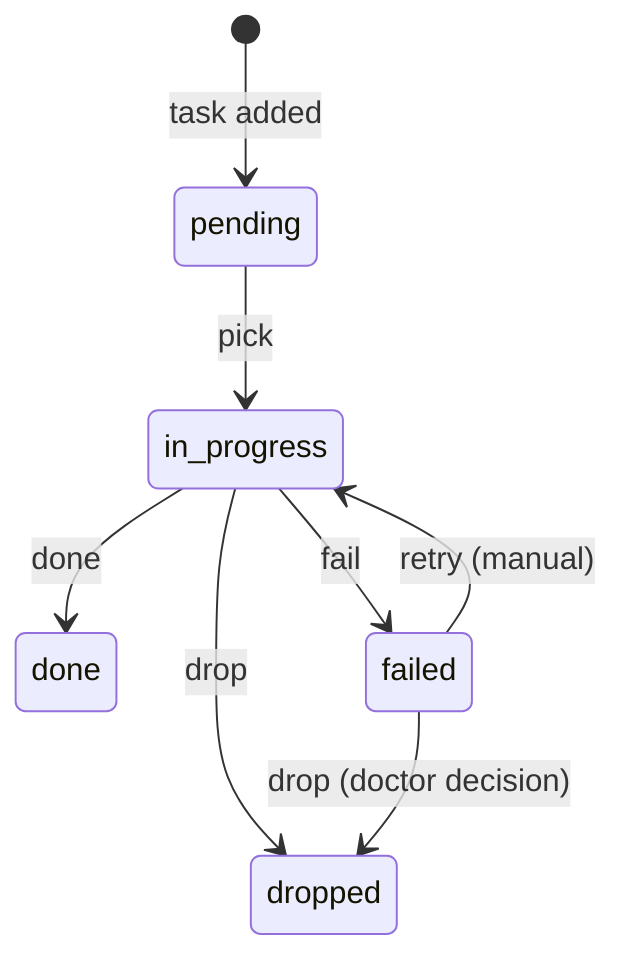
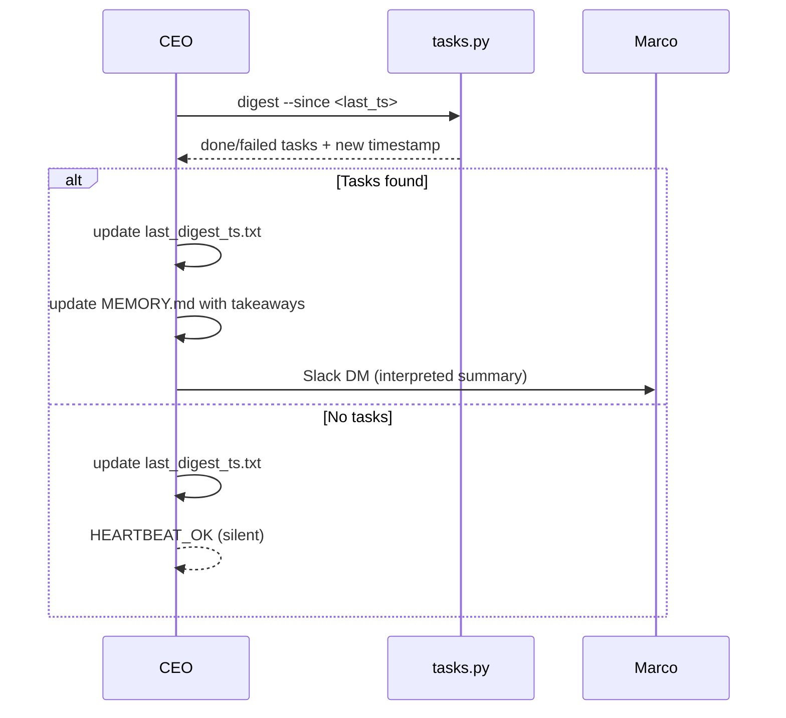

# :material-format-list-checks: Agent Task Queue

The task queue is how JourneyLoop agents assign work to each other and track it across heartbeat cycles. It replaces ad-hoc Slack messages and ephemeral memory as the coordination layer for async agent-to-agent delegation.

---

## Why It Exists

Before the task queue, agents had no reliable way to assign work to another agent. A PM could send a Slack message to the SWE agent, but if the SWE session restarted — or if the message was buried — the task was lost. Agents also couldn't inspect what work was pending for their teammates.

The task queue solves this with three properties:

- **Persistent** — tasks survive session restarts and gateway reboots
- **Agent-scoped** — each agent has its own queue; no shared mutable state
- **Inspectable** — JSON files in the workspace, readable by any agent or human

---

## Architecture

Each agent's queue lives at:

```
~/.openclaw/workspace/agents/<name>/TASKS.json
```

The file is created automatically the first time a task is added to an agent. All agents can read and write all queues — there's no access control. Trust is the protocol.

Tasks have five statuses: `pending` → `in-progress` → `done` / `failed` / `dropped`.

**Priority** is `high` > `normal` > `low`. Within the same priority tier, the oldest task is picked first (FIFO). This keeps the queue predictable and prevents starvation.

---

## Heartbeat Integration

On every heartbeat, each agent:

1. Picks the next pending task: `python3 skills/tasks/scripts/tasks.py pick --agent <name>`
2. If nothing is returned — stops and replies `HEARTBEAT_OK`
3. Works on the task
4. Marks it done or failed

**One task per heartbeat. No exceptions.** Agents don't loop through the queue in a single run. This keeps each heartbeat bounded and ensures that long tasks don't block the agent indefinitely.

!!! warning "Don't chain tasks in a single heartbeat"
    Picking a second task after finishing the first leads to unbounded run times and makes failure harder to diagnose. The next heartbeat will pick the next task.

---

## Cross-Agent Assignment

Any agent can add a task for any other agent:

```bash
python3 skills/tasks/scripts/tasks.py add \
  --agent swe \
  --title "Implement companion memory model" \
  --notes "See tech-spec: planning/companion/memory-system/tech-spec.md" \
  --priority high \
  --added-by cto
```

This is the primary coordination mechanism between agents. When the PM finishes a brief, it adds a task to the UX queue. When the CTO finishes a tech spec, it adds a task to the SWE queue. No Slack ping required.

---

## Failure Handling

Failed tasks are **never automatically cleaned up**. They stay in the queue with `status: "failed"`, the error message, and a retry count.

This is intentional. Failed tasks are diagnostic signals — they tell the `doctor` agent (or Dobby) what broke, when, and how many times it's been tried. Cleaning them up automatically would erase that history.



Done and dropped tasks older than 7 days are removed by `clean`. Failed tasks are exempt.

---

## CEO Team Digest

The CEO agent runs a team-wide digest on every heartbeat (every 30 minutes, 8am–10pm PST). It's the oversight layer built on top of the task queue — the mechanism that converts agent activity into situational awareness for Marco.

### How It Works

On each heartbeat, the CEO scans all agents' completed and failed tasks since its last check:

```bash
python3 skills/tasks/scripts/tasks.py digest \
  --since "$(cat agents/ceo/last_digest_ts.txt 2>/dev/null || echo '1970-01-01T00:00:00+00:00')"
```

The timestamp of the last digest is stored in `agents/ceo/last_digest_ts.txt` and updated after every run. This ensures no task is reported twice.

**If something happened** — the CEO sends Marco a Slack DM interpreting the work. Not a list of task IDs. A read on what the team accomplished, what it means, and whether anything needs attention. Three to five sentences. If something failed, the CEO names the impact and what should happen next.

**If nothing happened** — the CEO updates the timestamp file and replies `HEARTBEAT_OK`. Marco gets no message.

### The Hybrid Model

The design separates two concerns:

- **Done tasks are batched.** Marco gets a digest at most every 30 minutes, not a ping for every completed task. Low-stakes work doesn't interrupt.
- **Failed tasks surface immediately.** When the CEO runs its digest and finds failures, they're flagged prominently — with error details and retry counts — regardless of how minor the task seemed.

This means failures are never silently lost in a queue. The CEO is the mechanism that turns a `status: "failed"` entry into a human-visible alert.

### CEO Knowledge Base

After each digest, the CEO updates `agents/ceo/MEMORY.md` with key takeaways — patterns, recurring failures, velocity signals. This gives the CEO a running picture of team health across heartbeats, not just point-in-time snapshots.



---

## CLI Quick Reference

The skill lives at `skills/tasks/scripts/tasks.py`. Full reference in `skills/tasks/SKILL.md`.

| Command | Purpose |
|---------|---------|
| `pick --agent NAME` | Pick next pending task (marks in-progress) |
| `done ID --agent NAME --result "..."` | Mark done with summary |
| `fail ID --agent NAME --error "..."` | Mark failed — persists for diagnosis |
| `add --agent NAME --title "..."` | Add a task to any agent's queue |
| `list [--agent NAME] [--status pending]` | Inspect queues |
| `digest [--since TIMESTAMP]` | Done/failed summary for CEO digest |
| `clean [--days 7]` | Remove old done/dropped tasks |

Task IDs support prefix matching — the first 8 characters are enough.
