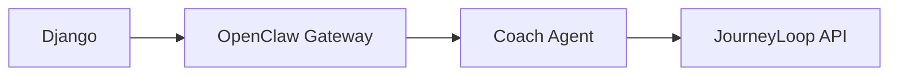

# Formatting Reference

Quick reference for MkDocs Material formatting features available in this site. All extensions are pre-configured — just use the syntax below.

Full reference: [squidfunk.github.io/mkdocs-material/reference](https://squidfunk.github.io/mkdocs-material/reference/)

---

## Admonitions

Call-out boxes for notes, warnings, and tips. [→ Full reference](https://squidfunk.github.io/mkdocs-material/reference/admonitions/)

```markdown
!!! note "Optional title"
    Content here.

!!! tip
    A tip.

!!! warning
    A warning.

!!! danger
    A danger callout.

!!! info
    Informational.
```

Collapsible (closed by default):
```markdown
??? note "Click to expand"
    Hidden content.
```

Available types: `note` `tip` `info` `warning` `danger` `success` `question` `failure` `bug` `example` `quote`

---

## Grids

Arrange content in responsive card grids — ideal for section landing pages. [→ Full reference](https://squidfunk.github.io/mkdocs-material/reference/grids/)

```html
<div class="grid cards" markdown>

- :material-clock-fast: **Fast to set up**

    Short description of this card.

    [:octicons-arrow-right-24: Learn more](link.md)

- :material-scale-balance: **Another card**

    Description here.

</div>
```

---

## Content Tabs

Tabbed sections for showing alternatives or grouped content. [→ Full reference](https://squidfunk.github.io/mkdocs-material/reference/content-tabs/)

```markdown
=== "Option A"
    Content for option A.

=== "Option B"
    Content for option B.
```

---

## Code Blocks

Syntax-highlighted code with optional line numbers and copy button. [→ Full reference](https://squidfunk.github.io/mkdocs-material/reference/code-blocks/)

````markdown
```python title="example.py" linenums="1"
def hello():
    return "world"
```
````

Inline: use backticks — `code here`

---

## Diagrams (Mermaid)

Architecture and flow diagrams rendered natively. [→ Full reference](https://squidfunk.github.io/mkdocs-material/reference/diagrams/)

````markdown

````

Supported: `graph` `sequenceDiagram` `classDiagram` `stateDiagram` `erDiagram` `gantt`

---

## Tables

Standard markdown tables — fully styled. [→ Full reference](https://squidfunk.github.io/mkdocs-material/reference/data-tables/)

```markdown
| Column A | Column B | Column C |
|----------|----------|----------|
| Value    | Value    | Value    |
```

---

## Text Formatting

```markdown
==highlighted text==          # yellow highlight
^^underlined text^^           # underline
~~strikethrough~~             # strikethrough
^superscript^                 # superscript
~subscript~                   # subscript
++ctrl+alt+del++              # keyboard key combo
```

---

## Icons & Emojis

[→ Icon search](https://squidfunk.github.io/mkdocs-material/reference/icons-emojis/#search)

```markdown
:material-check:              # Material icon
:fontawesome-brands-github:   # FontAwesome brand icon
:octicons-alert-16:           # Octicons
:smile:                       # Emoji
```

---

## Page Metadata

Front matter at the top of any `.md` file:

```yaml
---
title: Custom Page Title
description: Used in search and meta tags.
icon: material/cog
---
```

---

## Definition Lists

```markdown
Term
:   Definition here.

Another term
:   Its definition.
```

---

## Footnotes

```markdown
Here's a claim.[^1]

[^1]: Source or elaboration here.
```
