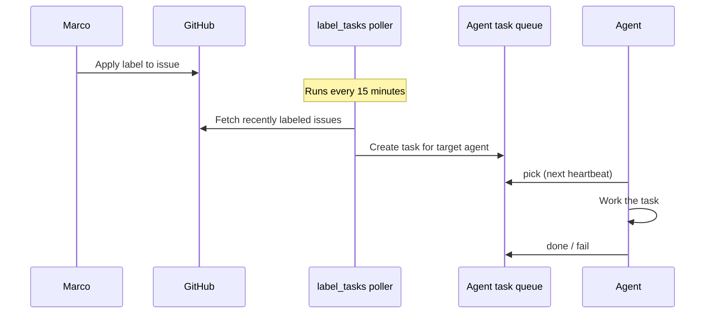

# :material-label-outline: GitHub Label → Agent Routing

Applying a label to a GitHub issue is all it takes to route work to an agent. A poller checks `arc-eng/journeyloop` every 15 minutes, maps new labels to agent queues, and creates tasks automatically. No Slack message, no manual dispatch.

---

## Why Labels

Labels are already how the team tracks issue state. Routing based on them adds zero friction for Marco — the same action that advances an issue through the lifecycle also dispatches work to the right agent.

The alternative (a separate dispatch step, or sending a Slack message to each agent) introduces a second system to remember and a second place to check. Labels collapse both into one.

---

## Routing Map

| Label | Routes to | Task created |
|-------|-----------|-------------|
| `needs-spec` | PM | Write product spec in issue body |
| `needs-ux` | UX | Design UX concept / wireframes |
| `needs-docs` | Docs | Write documentation for the feature |
| `auto-build` | SWE | Implement the changes and open a PR |
| `needs-code-review` | CTO | Automated code review on the PR |
| `needs-human` | Marco | Slack DM — requires founder attention |

---

## How It Works

1. Marco applies a label to an issue in `arc-eng/journeyloop`
2. The `label_tasks` poller fires within 15 minutes
3. A task is created in the target agent's queue with the issue as context
4. The agent picks it up at its next heartbeat and works it
5. The agent marks done or failed — no manual follow-up needed

---

## Other Notable Labels

These labels don't trigger agent routing but are part of the shared label vocabulary:

| Label | Meaning |
|-------|---------|
| `ready-for-dev` | Issue is scoped and ready for development |
| `needs-refinement` | CTO input needed before dev starts |
| `needs-work` | PR was reviewed and requires changes |
| `bug` · `feature` · `refactoring` · `technical-debt` | Standard categorization |

---

## Relationship to the Task Queue

Label routing is the entry point into the [agent task queue](agent-task-queue.md). The poller creates tasks using the same `tasks.py add` mechanism any agent can use directly. From the agent's perspective, a label-triggered task looks identical to a task added by another agent — it's just work in the queue.

This means label-routed tasks inherit all task queue properties: priority ordering, failure tracking, CEO digest visibility, and one-task-per-heartbeat discipline.
