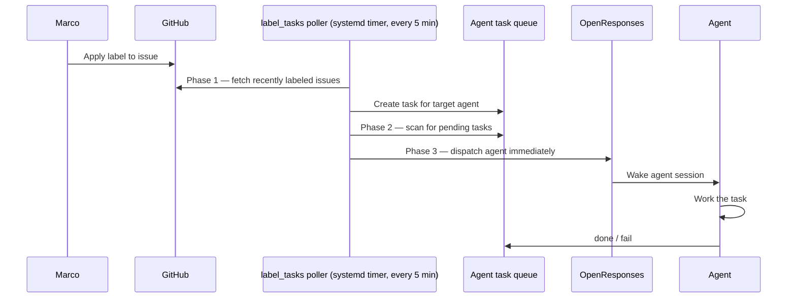

# :material-label-outline: GitHub Label → Agent Routing

Applying a label to a GitHub issue is all it takes to route work to an agent. A poller checks `arc-eng/journeyloop` every 5 minutes, maps new labels to agent queues, creates tasks, and immediately dispatches the target agent via the OpenResponses API. No Slack message, no manual dispatch, no waiting for a heartbeat.

---

## Why Labels

Labels are already how the team tracks issue state. Routing based on them adds zero friction for Marco — the same action that advances an issue through the lifecycle also dispatches work to the right agent.

The alternative (a separate dispatch step, or sending a Slack message to each agent) introduces a second system to remember and a second place to check. Labels collapse both into one.

---

## Routing Map

| Label | Routes to | Task created |
|-------|-----------|-------------|
| `needs-spec` | PM | Write product spec in issue body |
| `needs-ux` | UX | Design UX concept / wireframes |
| `needs-docs` | Docs | Write documentation for the feature |
| `auto-build` | SWE | Implement the changes and open a PR |
| `needs-code-review` | CTO | Automated code review on the PR |
| `needs-human` | Marco | Telegram notification — requires founder attention |
| `companion-tuning` | Companion Operator | Update agent markdown/skills — no standard lifecycle gates |

---

## How It Works

The poller runs three phases on every tick:

1. **Label scan** — fetch recently labeled issues, create tasks for any new labels not yet queued
2. **Pending task scan** — find tasks sitting in `pending` state across all agent queues
3. **Dispatch** — fire the target agent immediately via the OpenResponses API (no waiting for a self-triggered heartbeat)


```mermaid
sequenceDiagram
    participant Marco
    participant GitHub
    participant Poller as label_tasks poller (systemd timer, every 5 min)
    participant Queue as Agent task queue
    participant OpenResponses
    participant Agent

    Marco->>GitHub: Apply label to issue
    Poller->>GitHub: Phase 1 — fetch recently labeled issues
    Poller->>Queue: Create task for target agent
    Poller->>Queue: Phase 2 — scan for pending tasks
    Poller->>OpenResponses: Phase 3 — dispatch agent immediately
    OpenResponses->>Agent: Wake agent session
    Agent->>Agent: Work the task
    Agent->>Queue: done / fail
```

End-to-end handoff time is typically **under 5 minutes** — down from ~35 minutes with the old heartbeat-only model.

!!! info "No more worker crons"
    The previous architecture had per-agent task-worker crons firing every 30 minutes. Those are disabled. The `label_tasks` poller is now the sole dispatcher and handles both task creation and agent wakeup.

---

## Scheduler

The poller runs via **systemd timer** (`label-poller.timer` → `label-poller.service`), not an OpenClaw/LLM cron.

!!! success "Zero LLM dependency"
    The poller is a plain Python script. No Haiku agent wrapper, no Anthropic API call. It keeps running even when the Anthropic API is overloaded or rate-limited. The old OpenClaw cron `label-task-poller` is **disabled**.

```bash
# Check timer status
systemctl list-timers label-poller.timer

# View today's logs
cat ~/.openclaw/workspace/logs/label-poller/$(date +%Y-%m-%d).log

# Manually trigger a run
sudo systemctl start label-poller.service
```

Logs are written to `logs/label-poller/YYYY-MM-DD.log` and auto-trimmed to 1000 lines.

---

## Session Dedup Guard

Before dispatching an agent, the poller checks the agent's `sessions.json` for active OpenResponses sessions. If a session was updated within the last **30 minutes**, the agent is considered busy — dispatch is skipped and the task remains queued for the next cycle.

This prevents duplicate concurrent sessions when a long-running agent task is still in progress.

Sessions older than 30 minutes are treated as stale/finished and ignored.

---

## Retry Flag

If a task was incorrectly marked done or needs re-processing, clear its seen-set entry with `--retry`:

```bash
# Retry all labels on issue 349
python3 skills/label_tasks/scripts/label_task_poller.py --retry 349

# Retry a specific label on issue 349
python3 skills/label_tasks/scripts/label_task_poller.py --retry 349:auto-build

# Retry multiple issues
python3 skills/label_tasks/scripts/label_task_poller.py --retry 349 350 351
```

The next poller run will re-scan those issues and re-queue as needed.

---

## `needs-human` Notifications

When an issue is labeled `needs-human`, the poller sends a Telegram notification directly via `openclaw message send` CLI — no LLM agent in the loop. This ensures Marco is notified even when agents are unavailable or throttled.

---

## Dispatchable Agents

The poller dispatches agents by name. The current `DISPATCHABLE_AGENTS` list includes:

- `pm`, `ux`, `docs`, `swe`, `cto`, `ceo`, `doctor`, `claude-code-expert`

Agents not on this list won't be dispatched automatically — tasks will still be created but agents must self-pick on heartbeat.

---

## Other Notable Labels

These labels don't trigger agent routing but are part of the shared label vocabulary:

| Label | Meaning |
|-------|---------|
| `ready-for-dev` | Issue is scoped and ready for development |
| `needs-refinement` | CTO input needed before dev starts |
| `needs-work` | PR was reviewed and requires changes |
| `bug` · `feature` · `refactoring` · `technical-debt` | Standard categorization |

---

## Relationship to the Task Queue

Label routing is the entry point into the [agent task queue](agent-task-queue.md). The poller creates tasks using the same `tasks.py add` mechanism any agent can use directly. From the agent's perspective, a label-triggered task looks identical to a task added by another agent — it's just work in the queue.

This means label-routed tasks inherit all task queue properties: priority ordering, failure tracking, CEO digest visibility, and one-task-per-heartbeat discipline.
