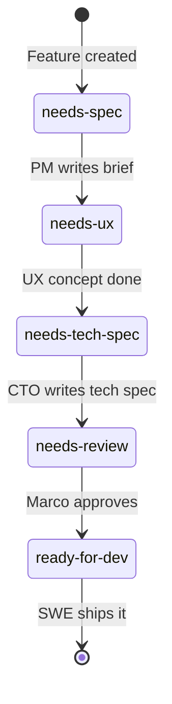

# :material-state-machine: Engineering Process

How the JourneyLoop agent team manages issues, specs, and development workflow.

---

## Repos

| Repo | Purpose | Short Ref |
|------|---------|-----------|
| `arc-eng/journeyloop` | Django app (code) | JL |
| `arc-eng/journeyloop-startup-assistant` | Planning, roadmap, specs | JL-SA |
| `arc-eng/journeyloop-docs` | Documentation site | JL-Docs |

---

## Planning Docs: One Folder Per Feature

Every feature gets a folder under its project namespace:

```
planning/<project>/<feature>/
  brief.md          ← Product spec: user stories, acceptance criteria
  ux.md             ← UX concept: layout, interaction, wireframes
  tech-spec.md      ← Technical architecture: system design, decisions
```

!!! tip "Not every feature needs every file"
    Backend-only features skip `ux.md`. Simple features might only need `brief.md`.

**Example structure:**

```
planning/companion/
  memory-system/
    brief.md
    tech-spec.md
  interface/
    brief.md
    ux.md
    tech-spec.md
  skill-system/
    brief.md
    ux.md
    tech-spec.md
```

---

## Issues: One Per Feature

Each feature has **one tracking issue** in `arc-eng/journeyloop-startup-assistant`. The substance lives in the planning folder — the issue is lightweight.

### Issue Format

```markdown
## [emoji] Feature Name

**Planning:** `planning/<project>/<feature>/`

| Vertical     | Status         |
|-------------|----------------|
| Product Spec | ✅ Done / 🔲 Not started / ➖ N/A |
| UX Concept   | ✅ Done / 🔲 Not started / ➖ N/A |
| Tech Spec    | ✅ Done / 🔲 Not started / ➖ N/A |

### Summary
One paragraph describing the feature and why it matters.
```

The status table is updated as verticals are completed.

---

## Lifecycle: Feature State Machine

Each feature issue carries **exactly one** lifecycle label at a time. The label answers: *"What does this feature need next?"*



### Lifecycle Labels

| Label | Set By | Means |
|-------|--------|-------|
| `needs-spec` | — | Feature needs a product spec (brief.md) |
| `needs-ux` | PM | Brief done, needs UX concept |
| `needs-tech-spec` | PM/UX | Ready for CTO to write tech-spec.md |
| `needs-review` | CTO | All specs done, needs Marco's review |
| `ready-for-dev` | Marco | Fully specced and approved, SWE can implement |
| `needs-po-input` | CTO | CTO needs product clarification |
| `needs-cto-input` | PM | PM needs technical assessment |
| `blocked-technical` | CTO | Technical blocker identified |

### Escalation Labels (to Marco)

!!! warning "Escalation labels trigger a ping to Marco"

| Label | Action | Means |
|-------|--------|-------|
| `needs-founder-decision` | :material-bell: Ping Marco | Above agent authority — options + recommendation |
| `needs-founder-approval` | :material-bell: Ping Marco | Both agents signed off, need go/no-go |
| `founder-fyi` | Silent | Awareness only |

---

## Agent Roles

| Role | Owns | Transitions |
|------|------|------------|
| :material-briefcase-outline: **PM** | `brief.md`, acceptance criteria, prioritization | `needs-spec` → `needs-ux` or `needs-tech-spec` |
| :material-wrench-outline: **CTO** | `tech-spec.md`, architecture decisions, PR review | `needs-tech-spec` → `needs-review` |
| :material-palette-outline: **UX Agent** | `ux.md`, interaction design, wireframes | `needs-ux` → `needs-tech-spec` or `needs-review` |
| :material-crown-outline: **Marco** | Founder decisions, approvals | `needs-review` → `ready-for-dev` |
| :material-code-braces: **SWE** | Implementation, PRs | `ready-for-dev` → done |

---

## Label Taxonomy

=== ":material-tag-outline: Type"

    `feature` · `bug` · `tech-debt` · `enhancement` · `adr`

=== ":material-layers-outline: Area"

    `backend` · `frontend` · `api` · `cli` · `calendar` · `ai`

=== ":material-resize: Size"

    `size/S` · `size/M` · `size/L` · `size/XL`

=== ":material-alert-outline: Priority"

    `p0-critical` · `p1-high` · `p2-medium` · `p3-low`

=== ":material-folder-outline: Category"

    `vision` · `bug` · `enhancement` · `epic`

---

## Documentation Rules

!!! example "Every label change gets a comment"
    Explain **WHY** the label changed and **WHO** needs to act next.

### Comment signing

All agents sign their comments:

- `— PO Agent`
- `— CTO Agent`
- `— UX Agent`
- `— SWE Agent`

### Specs are files, not comments

!!! danger "Never paste spec content into issue comments"
    Tech specs, UX concepts, and briefs are **files** in the planning folder. Issue comments are **transition signals only** — one line linking the file. Pasting specs into comments creates drift if the file changes.

=== ":material-check: Good comment"

    ```
    Tech spec written: `planning/companion/interface/tech-spec.md`
    Removing `needs-tech-spec`, adding `needs-review`.
    — CTO Agent
    ```

=== ":material-close: Bad comment"

    ```
    ## Tech Spec
    ### Architecture
    We will use Django REST framework to...
    [2000 words of spec content pasted inline]
    — CTO Agent
    ```

### Acceptance criteria use checkboxes

```markdown
## Acceptance Criteria
- [ ] CompanionMemory model created with required fields
- [ ] Migration generated and tested
- [ ] Unit tests for model validation
```

When checking off criteria, comment what you did:

```
✅ Checked off "Add companion memory model"
— Added CompanionMemory in companion/models.py with migration 0001.
— SWE Agent
```

---

## Epics

Epics group related features. They're checklist issues — no specs or acceptance criteria of their own.

```markdown
## [emoji] Epic Name
Why this matters — 1-2 sentences.

### Features
- [ ] #XX — Feature Name (`current-label`)
- [ ] #YY — Feature Name (`current-label`)
- [x] #ZZ — Feature Name (`done`)
```

!!! warning "Max 2 active epics at any time."

---

## Implementation Issues

When a feature reaches `ready-for-dev`, implementation issues are created in `arc-eng/journeyloop` (the code repo):

```markdown
**As a** [role],
**I want** [goal]
**so that** [value].

## Acceptance Criteria
- [ ] Testable condition (max 3 per issue — split if more)

## Planning
See: `planning/<project>/<feature>/` in journeyloop-startup-assistant
```

---

## Slack Channels

| Channel | Purpose |
|---------|---------|
| `#development` | Short log entries for every completed task |
| `#reviews` | Review threads for specs and PRs |
| `#scrum` | Daily standups and sprint coordination |
