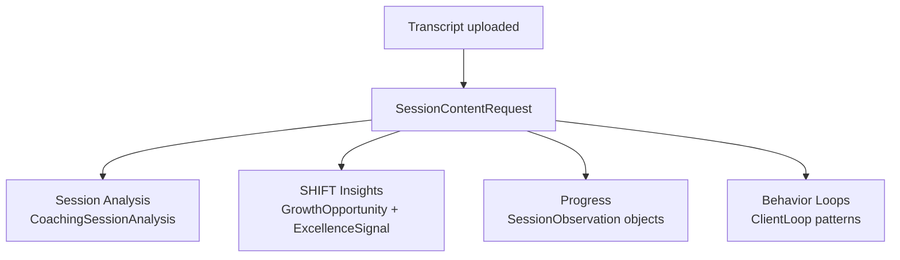

# :material-map-outline: JourneyLoop — Platform Reference

## What is JourneyLoop?

JourneyLoop is an AI-powered coaching companion platform for independent coaches. Its tagline: *"You hold space for everyone. But who holds space for you?"*

!!! quote "Core premise"
    Coaching is an isolated profession. JourneyLoop fixes that by acting as a companion to the coach — capturing every session, surfacing insights, reflecting growth, and preparing coaches for what's next. Coaches don't manually take notes or review transcripts. JourneyLoop handles that automatically.

**The product does three things:**

-   :material-record-circle-outline: **Record & Transcribe**

    Coaching sessions captured automatically via a Recall.ai bot joining Zoom, Meet, or Teams.

-   :material-chart-line: **Analyze Quality**

    Transcripts analyzed using the SHIFT framework — giving coaches structured feedback on their coaching quality.

-   :material-trending-up: **Track Progress**

    Client progress tracked across goals, milestones, and behavior patterns over time — with no manual input.

---

## Core Data Model

### :material-account-tie: Coach (`CoachingProfile` → `auth.User`)

The primary user. Has a name, business name, coaching niche, and description. Owns all clients and sessions.

---

### :material-account: Client (`CoachingClient`)

Belongs to one coach.

| Field | Description |
|-------|-------------|
| `name`, `email` | Identity |
| `total_sessions` | Sessions in the coaching package (e.g., 6 or 12) |
| `actual_completed_sessions` | Dynamic count (date ≤ today, type = regular) |
| `sessions` | → `CoachingSession` objects |
| `progress_goals` | → `CoachingGoal` objects |
| `milestones` | → `CoachingMilestone` objects |
| `has_consented` | Client must consent before AI can process their transcripts |

!!! note
    Clients may optionally have portal access via a linked `auth.User`.

---

### :material-calendar-clock: Session (`CoachingSession`)

A single coaching meeting.

| Field | Description |
|-------|-------------|
| `client` | FK to `CoachingClient` |
| `title`, `date`, `session_type` | `regular` or `intake` — intake doesn't count toward package total |
| `transcript` | Full text (deferred by default for performance; use `all_fields` manager when needed) |
| `transcript_json` | Raw JSON from Recall.ai with timestamps |
| `meeting_url`, `recall_bot_id`, `recall_bot_status` | Recall.ai recording integration |
| `progress_extracted` | Whether AI has processed this session |
| `is_completed` | Property: `date <= today` |

---

### :material-chat-outline: Utterance (`SessionUtterance`)

Individual speech segment from a transcript.

| Field | Description |
|-------|-------------|
| `speaker_type` | `coach` or `client` |
| `text_clean` | Cleaned text |
| `sequence_number` | 1-based ordering |
| `timestamp_min` / `timestamp_sec` | Position in session |

---

## The SHIFT Framework

!!! info "About SHIFT"
    SHIFT is JourneyLoop's proprietary coaching quality model, grounded in ICF competencies and evidence-based coaching research. After each session, AI analyzes the transcript against 5 principles, identifying moments where the coach applied them well (**Excellence Signals**) or missed an opportunity (**Growth Opportunities**).

**SHIFT = S · H · I · F · T**

=== ":material-emoticon-outline: S — Surface Emotion"

    *Notice, name, and validate client emotions when they arise.*

    **Patterns — what good looks like:**

    | Pattern | Description |
    |---------|-------------|
    | Label the Feeling | Coach reflects client's emotional language (*"That overwhelm sounds really heavy for you."*) |
    | Ask About Emotion | Coach directly inquires about feelings (*"What feelings are coming up as you say that?"*) |
    | Affective Mirroring | Coach's tone matches client's emotional state |

    **Anti-patterns — missed opportunities:**

    | Anti-pattern | Description |
    |--------------|-------------|
    | Task-Switch after Emotion | Pivoting to tasks right after emotional disclosure |
    | Emotion Avoidance | Ignoring or sidestepping emotional cues |
    | Affect-Free Paraphrase | Paraphrasing content without reflecting the emotion |

=== ":material-hand-back-right-outline: H — Hand Back Ownership"

    *Return agency to the client. Let them define direction and next steps.*

    **Patterns:**

    | Pattern | Description |
    |---------|-------------|
    | Invite Decisions | Coach asks client to define their own solutions |
    | Agency Language | Framing that emphasizes the client's choice (*"It's your choice which step you take first."*) |
    | Curiosity over Advice | Using inquiry instead of giving answers |

    **Anti-patterns:**

    | Anti-pattern | Description |
    |--------------|-------------|
    | Preemptive Advice | Offering solutions before the client has a chance to find their own |
    | Goal Takeover | Coach reshapes or restates the client's goals with their own agenda |
    | Directed Solutions | Dictating what the client should do |

=== ":material-lightbulb-on-outline: I — Illuminate Contradictions"

    *Spot and reflect inconsistencies, limiting beliefs, or avoidance in the client's language.*

    **Patterns:**

    | Pattern | Description |
    |---------|-------------|
    | Name the Tension | Coach reflects contradictions (*"You say you want to take risks, yet uncertainty feels intolerable — how do those fit together?"*) |
    | Values-Behavior Check | Highlighting misalignment between stated values and actions |
    | Invite the Disowned | Exploring topics the client is avoiding |

    **Anti-patterns:**

    | Anti-pattern | Description |
    |--------------|-------------|
    | Contradiction Blindness | Ignoring clear inconsistencies in the client's narrative |
    | Comfort Detour | Sidestepping difficult or uncomfortable material |
    | Reassure Instead of Explore | Soothing away contradictions rather than exploring them |

=== ":material-magnify: F — Find the Pattern"

    *Name meaningful themes or behavioral loops visible within (and across) the session.*

    **Patterns:**

    | Pattern | Description |
    |---------|-------------|
    | Theme Detection | Identifying a recurring theme in the client's language |
    | Name Core Driver | Identifying a deeper belief or value driving behavior |
    | Reframe to Meta | Lifting the narrative to a higher pattern-based level |

    **Anti-patterns:**

    | Anti-pattern | Description |
    |--------------|-------------|
    | Surface Parroting | Repeating client words without deeper synthesis |
    | Theme Avoidance | Ignoring recurring signals |
    | Reactive Only | Responding moment-to-moment without connecting the dots |

=== ":material-lightning-bolt-outline: T — Turn Insight into Action"

    *Help the client translate reflection into clear, specific, committed next steps.*

    **Patterns:**

    | Pattern | Description |
    |---------|-------------|
    | Elicit Concrete Action | Asking the client to define their own next steps (*"What's one specific action you'll take this week?"*) |
    | Make It Measurable | Encouraging time-bound, specific commitments |
    | Reflect Decisions Made | Consolidating commitments voiced during the session |

    **Anti-patterns:**

    | Anti-pattern | Description |
    |--------------|-------------|
    | No Next Step | Session ends without any explicit action |
    | Insight-Only Closure | Celebrating insight but skipping action planning |
    | Coach-Defined Action | Prescribing steps instead of eliciting them |

---

## AI-Generated Session Content

When a transcript is uploaded, a `SessionContentRequest` processes four things asynchronously:

| Output | Model | Description |
|--------|-------|-------------|
| Session Analysis | `CoachingSessionAnalysis` | Overall session summary, themes, key takeaways |
| SHIFT Insights | `GrowthOpportunity` + `ExcellenceSignal` | Linked to specific utterances, with coach feedback and better examples |
| Progress | `SessionObservation` | Extracted from utterances, linked to goals/milestones with numeric delta impact |
| Behavior Loops | `ClientLoop` | Recurring trigger-response-consequence patterns across sessions |

---

## Progress Tracking

=== ":material-flag-outline: Goals"

    Long-running objectives via `CoachingGoal`.

    - `slug` — unique per client, used for AI reference
    - `title`, `status` — `active` / `paused` / `complete`
    - Progress accumulates via `ObservationGoal` delta links (−0.10 to +0.10 per observation)

=== ":material-calendar-check-outline: Milestones"

    Date-driven events via `CoachingMilestone`.

    - `target_date`, `status` — `upcoming` / `completed` / `missed`
    - Example: *"Sales presentation on March 15th"*

=== ":material-eye-outline: Observations"

    AI-extracted client moments via `SessionObservation`.

    - `stance` — `struggle` / `intent` / `plan` / `reflection` / `outcome`
    - `valence` — −1.0 to 1.0
    - `intensity`, `certainty` scores
    - Linked to goals and milestones with delta impacts

=== ":material-refresh: Behavior Loops"

    Cross-session patterns via `ClientLoop`.

    - Structure: `trigger` → `response` → `consequence`
    - Status: `emerging` / `active` / `evolving` / `resolved`

---

## Companion API

!!! info "Authentication"
    Bearer token auth via `CompanionAPIKeyAuthentication`. Scoped to the coach who owns the key. Base path: `/api/companion/v1/`

**Clients**

| Method | Path | Description |
|--------|------|-------------|
| `GET` | `/clients/` | List clients (id, name, email) |
| `GET` | `/clients/<id>/` | Client detail with goals and milestones |
| `GET` | `/clients/search/?q=` | Search clients by name |
| `GET` | `/clients/<id>/sessions/` | All sessions for a client |
| `GET` | `/clients/<id>/goals/` | List goals |
| `POST` | `/clients/<id>/goals/` | Create a goal |
| `PATCH` | `/clients/<id>/goals/<goal_id>/` | Update goal title or status |
| `DELETE` | `/clients/<id>/goals/<goal_id>/` | Delete a goal |

**Sessions**

| Method | Path | Description |
|--------|------|-------------|
| `GET` | `/sessions/upcoming/` | Upcoming sessions (next 7 days) |
| `GET` | `/sessions/recent/?limit=N` | Recent past sessions (default 10) |
| `GET` | `/sessions/<id>/` | Session detail |
| `GET` | `/sessions/<id>/transcript/` | Raw transcript text |

**Profile**

| Method | Path | Description |
|--------|------|-------------|
| `PATCH` | `/profile/` | Update companion profile (e.g., set name) |

---

## Key Integrations

-   :material-video-outline: **Recall.ai**

    Recording bot that joins video calls (Zoom, Meet, Teams) and captures live transcripts.

-   :material-calendar-outline: **Google Calendar**

    Auto-creates sessions from calendar events.

-   :material-credit-card-outline: **Stripe**

    Coach subscription billing — Starter free, paid tiers for more clients.

-   :material-account-circle-outline: **Client Portal**

    Clients can log in, view session takeaways, and track their own progress.

